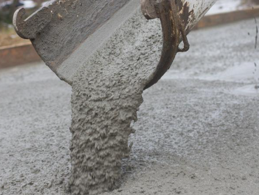

# Concrete-Strength-Prediction

This project aims to predict the durability performance of Recycled Aggregate Concrete (RAC) to assess its feasibility and suitability in sustainable construction practices. The concrete data dataset was used in this analysis and obtained from the Kaggle website. It includes approximately 1030 instances and 9 features. The concrete compressive strength is a regression problem. The order of this listing corresponds to the order of numerals along the rows of the database.

# Methodology
The methodology used is Linear regression Backward Elimination (BE), AdaBoost regressor, Xgboost regressor and random forest regressor to compare with the highest R-squared Adjusted (R2). 

# Implementation
All the steps taken in this project are outliers check, Exploratory Data Analysis (EDA), Feature selection, and training the prediction models. The project was implemented using the Scikit Learn library in Python programming. 

# Results
The XG Boost regressor performs best on both the training and test sets. It has the highest R-squared and adjusted R-squared values on the test set of 0.943254, and 0.942663, and a Root mean square error (RMSE) score of 4.080221. The Mean Squared Error (MSE) values for RAC and Conventional Concrete of 15.69 and 15.89 respectively were obtained.
The optimal mix design for RAC contains 475 kg/m³ of cement, 0 kg/m³ of blast furnace slag, 0 kg/m³ of fly ash, 228 kg/m³ of water, 0 kg/m³ of superplasticizer, 932 kg/m³ of coarse aggregate, and 594 kg/m³ of fine aggregate. This mix design will produce RAC with a compressive strength of 38.6 MPa at 7 days. An optimal resource efficiency of 75.54% means that the process or system is using 75.54% of its resources as efficiently as possible.

